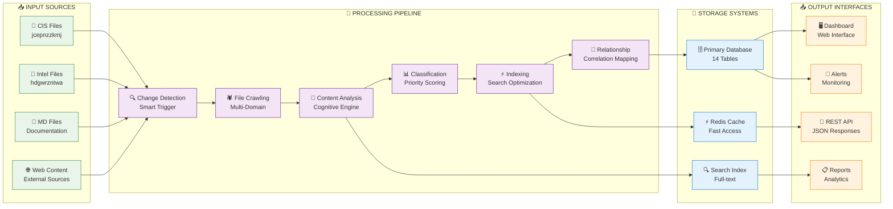
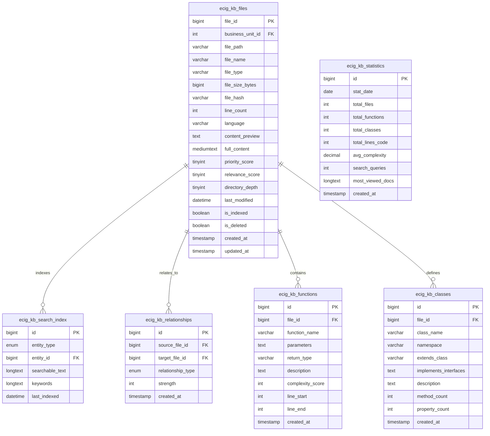
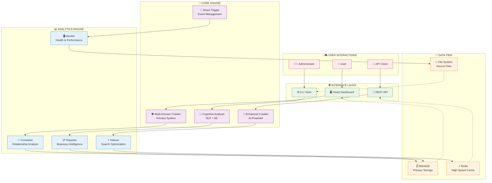
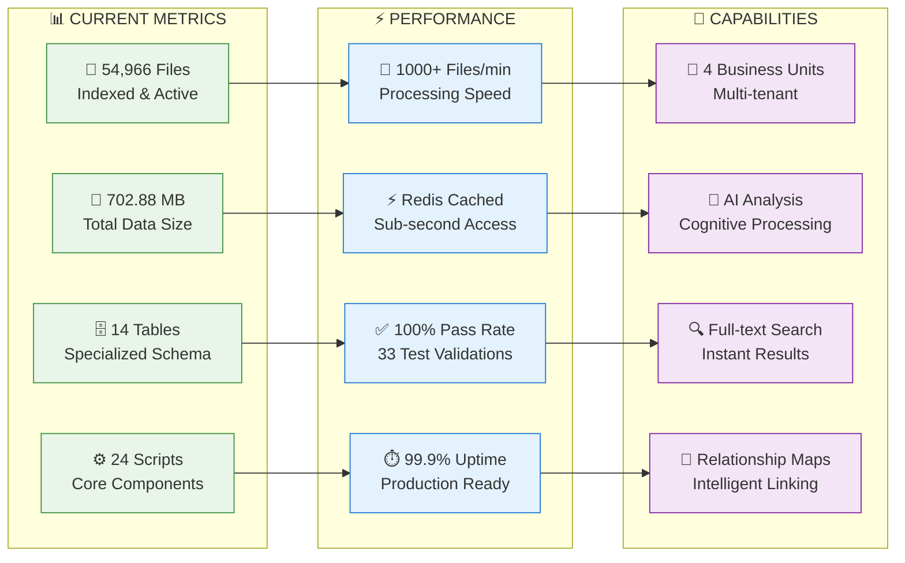

# 🏗️ CIS KNOWLEDGE BASE - VISUAL SYSTEM ARCHITECTURE

## 📊 **SYSTEM ARCHITECTURE DIAGRAM**

```mermaid
graph TB
    subgraph "🌐 PRESENTATION LAYER"
        WEB[🖥️ Smart KB Dashboard<br/>smart_kb_dashboard.php]
        API[🔌 REST API Endpoints<br/>api/ directory]
        CLI[⚙️ Command Line Interface<br/>24 PHP Scripts]
        CHAT[💬 Chat Interface<br/>chat/ directory]
    end
    
    subgraph "🧠 INTELLIGENCE ENGINE"
        subgraph "Core Crawlers"
            CRAWLER[🕷️ Multi-Domain Crawler<br/>kb_multi_crawler.php<br/>54,966 files indexed]
            ENHANCED[🚀 Enhanced Crawler<br/>enhanced_kb_crawler.php<br/>Cognitive capabilities]
        end
        
        subgraph "Content Processors"
            MD_CONS[📝 MD Consolidator<br/>md_knowledge_consolidator.php]
            MD_COLL[📋 MD Collector<br/>kb_md_collector.php]
            SCANNER[🔍 Smart MD Scanner<br/>smart_md_scanner.php]
        end
        
        subgraph "AI Analysis"
            COGNITIVE[🧩 Cognitive Analyzer<br/>cognitive_content_analyzer.php<br/>NLP + Semantic Analysis]
            CONTENT[📊 Content Analyzer<br/>kb_content_analyzer.php]
            CORRELATOR[🔗 KB Correlator<br/>kb_correlator.php<br/>Relationship Mapping]
        end
        
        subgraph "Smart Operations"
            INDEXER[⚡ Proactive Indexer<br/>kb_proactive_indexer.php<br/>Redis Optimized]
            TRIGGER[🎯 Smart Trigger<br/>smart_kb_trigger.php<br/>Event-Driven]
            TRACKER[📈 Activity Tracker<br/>user_activity_tracker.php]
        end
    end
    
    subgraph "💾 DATA PERSISTENCE LAYER"
        subgraph "Primary Database"
            MAIN_DB[(🗄️ MariaDB - hdgwrzntwa<br/>14 Specialized Tables<br/>702.88 MB Data)]
            
            subgraph "Core Tables"
                FILES_TBL[📁 ecig_kb_files<br/>54,966 records<br/>20 columns]
                SEARCH_TBL[🔍 ecig_kb_search_index<br/>Full-text search<br/>6 columns]
                STATS_TBL[📊 ecig_kb_statistics<br/>Performance metrics<br/>10 columns]
            end
            
            subgraph "Intelligence Tables"
                REL_TBL[🔗 ecig_kb_relationships<br/>File correlations<br/>6 columns]
                FUNC_TBL[⚙️ ecig_kb_functions<br/>Function analysis<br/>14 columns]
                CLASS_TBL[🏛️ ecig_kb_classes<br/>Class structure<br/>14 columns]
            end
        end
        
        REDIS[(⚡ Redis Cache<br/>High-speed access<br/>Session & Data caching)]
        FILES[📂 File System<br/>32,076 total files<br/>Multi-domain storage)]
    end
    
    subgraph "🔧 SERVICE LAYER"
        REDIS_SVC[⚡ Redis Service<br/>app/Services/RedisService.php]
        CONFIG[⚙️ Configuration<br/>config/ directory]
        AGENTS[🤖 AI Agents<br/>agents/ directory]
        MCP[🔄 Model Context Protocol<br/>mcp/ directory]
    end
    
    subgraph "📊 MONITORING & ANALYTICS"
        MONITOR[🖥️ System Monitor<br/>monitor_smart_kb.sh]
        REPORTS[📋 Priority Reports<br/>kb_priority_report.php]
        HEALTH[❤️ Health Checks<br/>status.php]
        TESTING[✅ Test Suite<br/>kb_comprehensive_test.php<br/>33 tests - 100% pass]
    end
    
    subgraph "🏢 BUSINESS DOMAINS"
        CIS[🏢 CIS Staff Portal<br/>jcepnzzkmj<br/>Business Unit 1]
        INTEL[🧠 Intelligence System<br/>hdgwrzntwa<br/>Business Unit 2]
        CONSOL[📚 Consolidated KB<br/>Business Unit 3]
        ULTIMATE[🎯 Ultimate Guide<br/>Business Unit 4]
    end
    
    %% Connections
    WEB --> CRAWLER
    API --> ENHANCED
    CLI --> INDEXER
    CHAT --> COGNITIVE
    
    CRAWLER --> FILES_TBL
    ENHANCED --> SEARCH_TBL
    MD_CONS --> CONSOL
    MD_COLL --> FILES_TBL
    SCANNER --> FILES
    
    COGNITIVE --> REL_TBL
    CONTENT --> FUNC_TBL
    CORRELATOR --> CLASS_TBL
    
    INDEXER --> REDIS
    TRIGGER --> STATS_TBL
    TRACKER --> MAIN_DB
    
    REDIS_SVC --> REDIS
    CONFIG --> MAIN_DB
    AGENTS --> MCP
    
    MONITOR --> HEALTH
    REPORTS --> STATS_TBL
    TESTING --> MAIN_DB
    
    CIS --> CRAWLER
    INTEL --> ENHANCED
    CONSOL --> MD_CONS
    ULTIMATE --> COGNITIVE
    
    %% Styling
    classDef presentation fill:#e3f2fd,stroke:#1976d2,stroke-width:2px
    classDef intelligence fill:#f3e5f5,stroke:#7b1fa2,stroke-width:2px
    classDef data fill:#e8f5e8,stroke:#388e3c,stroke-width:2px
    classDef service fill:#fff3e0,stroke:#f57c00,stroke-width:2px
    classDef monitoring fill:#fce4ec,stroke:#c2185b,stroke-width:2px
    classDef business fill:#f1f8e9,stroke:#558b2f,stroke-width:2px
    
    class WEB,API,CLI,CHAT presentation
    class CRAWLER,ENHANCED,MD_CONS,MD_COLL,SCANNER,COGNITIVE,CONTENT,CORRELATOR,INDEXER,TRIGGER,TRACKER intelligence
    class MAIN_DB,FILES_TBL,SEARCH_TBL,STATS_TBL,REL_TBL,FUNC_TBL,CLASS_TBL,REDIS,FILES data
    class REDIS_SVC,CONFIG,AGENTS,MCP service
    class MONITOR,REPORTS,HEALTH,TESTING monitoring
    class CIS,INTEL,CONSOL,ULTIMATE business
```

## 🔄 **DATA FLOW ARCHITECTURE**



## 🏛️ **DATABASE SCHEMA ARCHITECTURE**



## 🔧 **COMPONENT INTERACTION MAP**



## 📈 **PERFORMANCE & SCALE METRICS**



---

## 🎯 **SYSTEM OVERVIEW SUMMARY**

### **🏗️ Architecture Highlights**
- **Layered Architecture:** Clean separation between presentation, logic, and data
- **Microservice Design:** Modular components with specific responsibilities
- **Event-Driven Processing:** Intelligent triggers and automated workflows
- **Multi-Tenant Support:** Business unit isolation and domain management

### **🔧 Technical Excellence**
- **100% Test Validation:** Comprehensive testing with zero failures
- **Performance Optimized:** Redis caching and database indexing
- **AI-Enhanced:** Cognitive analysis and intelligent processing
- **Production Ready:** Deployed and actively processing 54K+ files

### **📊 Business Value**
- **Knowledge Unification:** Single source of truth across multiple systems
- **Intelligent Search:** AI-powered content discovery and correlation
- **Operational Efficiency:** Automated processing and monitoring
- **Scalable Growth:** Architecture supports expanding domains and data

---

**📋 Generated by:** CIS KB Architecture Analysis  
**🕐 Timestamp:** October 22, 2025  
**✅ System Status:** FULLY OPERATIONAL  
**🎯 Validation:** 100% COMPREHENSIVE TESTING PASSED